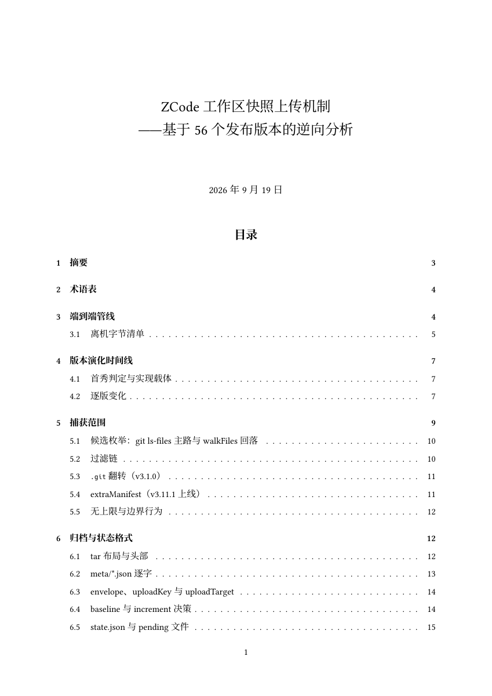

# ZCode Teardown

ZCode IDE linux-x64 全版本逆向拆解：56 个发行版（v2.2.0–v3.14.0）的下载、解包、指纹快照、逐版差异与分析笔记。核心交付物为[工作区快照上传机制分析报告](notes/2026-09-19-工作区快照上传.pdf)（27 页）——基于全部 56 个版本的端到端逆向，覆盖捕获范围、加密管线、同意门演化与披露审计。

[](notes/2026-09-19-工作区快照上传.pdf)

## 快照上传管线

ZCode 在每次发送 prompt 时将整个工作区打包加密上传至厂商服务端。v3.1.0 起包含完整 `.git/` 目录（remote URL token、reflog、pack 文件全收），v3.11.1 起追加全局配置与 prompt 附件。上传经 AES-256-CTR 加密 + RSA-OAEP-SHA256 密钥包装，通过阿里云 OSS PostObject 直传。v3.14.0 起整个功能族（捕获管线、`/api/v1/snapshot/upload-credential` 端点、两个设置开关、`settings.indexing` UI 与 repo-wiki 本地功能）被整体移除，28 项追踪指标全部归零。


同意门经三阶段演化：v2.3.0 诚实的 opt-in → v2.6.0 静默翻转为 opt-out → v3.1.0 开关移出管线成为纯装饰。此后是否上传只由登录态、workspace 类型与服务端 credential 签发决定。功能存续的 55 个版本 UI 从未披露此行为；v3.14.0 连开关本体一并移除。


## 仓库结构

| 路径           | 内容                                                             |
| -------------- | ---------------------------------------------------------------- |
| `manifest/`    | 版本清单与来源记账（56/59 版，3 版 CDN 撤下不可恢复）            |
| `signatures/`  | 每版签名快照（models/endpoints/feature_flags/env_vars 等 10 类） |
| `notes/`       | 分析笔记（13 篇 markdown + 1 篇 LaTeX 报告 + 图表资源）          |
| `tools/`       | 管道脚本（fetch → unpack → manifest → commit → signature）       |
| `tools/sweep/` | 多客户端隐藏上传扫描流水线（Workflow 脚本 + 判定口径）           |
| `docs/`        | 任务复盘                                                         |

不入库的可再生产出：`installers/`、`extracted/`、`repo/`（bare git 语料库）、`diffs/`、`tmp/`。

## 分析笔记

### 版本线

- [2.x 系列](notes/line-2.x.md)——2.2.0→2.13.0，五运行时堆栈时代
- [3.1.x](notes/line-3.1.md)——glm 引擎首秀
- [3.2–3.3](notes/line-3.2-3.3.md)——三代签名器交叠
- [3.4–3.6](notes/line-3.4-3.6.md)——intent 调度器与全链 abort
- [3.7–3.8](notes/line-3.7-3.8.md)——断档期的 AppImage 恢复
- [3.9–3.12](notes/line-3.9-3.12.md)——extraManifest 与磁盘配额
- [3.14](notes/line-3.14.md)——dynamic workflows 引擎化、CUA 重写、快照上传族移除（3.13.x 跳号）
- [断代分析](notes/epoch-gap.md)——2.13.0→3.1.0 引擎更换

### 专题

- [引擎架构](notes/engine.md)——agent 引擎组织与演化
- [协议面](notes/protocol.md)——ACP / IPC / endpoints / proxy
- [运行时](notes/runtime.md)——Electron 宿主与 bundled tools
- [扩展系统](notes/extensions.md)——plugins / skills / commands / native modules
- [外部宣称](notes/community-intel.md)——官方渠道与第三方社区的宣称档案
- [开源包核对](notes/open-source-drop.md)——zai-org/ZCode 源码发布（3.14.0-squashed）与二进制逐版分析的交叉验证

### 横向扫描

- [多客户端隐藏上传扫描](notes/sweep/README.md)——45 个闭源 agentic coding 客户端的同款机制批量审计（17 个确认隐藏上传、11 个披露失真，含 Cursor/Qoder/MiniMax Desktop/Copilot Chat 等）

### 快照上传报告

- [LaTeX 源](notes/2026-09-19-工作区快照上传.tex) → [PDF](notes/2026-09-19-工作区快照上传.pdf)（27 页，A4）
- [Markdown 源稿](notes/2026-09-19-工作区快照上传.md)
- [28 指标 × 56 版矩阵](notes/snapshot-tracking.json)
- 图表：[管线](notes/assets/snapshot-upload-pipeline.svg) · [时间线](notes/assets/snapshot-upload-timeline.svg) · [同意门](notes/assets/snapshot-upload-consent.svg) · [可见性矩阵](notes/assets/snapshot-upload-visibility.svg)

## 管道

五步流水线，每步带 `[lane]` 参数供并行作业对账：

```bash
tools/fetch.sh <ver> [lane]            # CDN 分块下载 + 校验（24MiB chunk，限流重试）
tools/unpack.sh <ver> [lane]           # .deb → extracted/<ver>/（含 asar 解包）
tools/tree_manifest.py <ver> [lane]    # 全树 sha256 + engine/tools/host 指纹
tools/commit_version.sh <ver> [lane]   # 快照进 repo/ git + v<ver> tag
tools/extract_signatures.py <ver>      # 10 类签名 → signatures/<ver>.json
```

`repo/` 是独立 bare git 仓，存各版本 extracted 树的 `v<ver>` tag（56 个）。版本间差异用 `git -C repo diff vA vB`，不要去翻 `extracted/` 手动 diff。

### 语料覆盖

59 个已发布版本中 56 个完成全链入库；3.7.1/3.7.2/3.7.4 被 CDN rolling-pull 撤下，按 `published-but-unrecoverable` 记账（保留 size/sha512/releaseDate 证据）。15 版为替代格式恢复（win-exe×5、AppImage×9、mac dmg×1），`manifest/provenance.json` 逐版记账。3.13.x 整条线未在 linux-x64 发布，版本号自 3.12.3 直跳 3.14.0。

### 官方证据面状态（2026-09-19）

**安装包实物未被清理**：55 个 linux-x64 deb + 15 个替代格式安装包全部仍可下载（全量 HEAD 探测复核，除已记账的 3.7.x 三件外零缺口）。被撤的是两类外围面：

- **逐版 `latest*.yml` 静态归档**：CDN 级 404（含此前已存档的版本），本仓 `manifest/` 内留有 77 版 yml 抓取存档。
- **3.7.1/3.7.2/3.7.4 三件 deb**：rolling-pull 撤下，CDN 侧仅剩中途断流的 206 缓存残影。

官方元数据渠道迁移至应用内更新 manifest API（`zcode.z.ai/api/v1/releases/electron/manifest?platform=<plat>`，只服务最新版，双语 releaseNotes + 全平台 sha512）——其 3.14.0 deb sha512 与本仓自算值逐字节一致，官网 changelog 亦已列至 3.14.0。即：二进制证据面完整，披露渠道从静态逐版归档收缩为"仅最新版"的应用内接口。

### 官方证据面状态（2026-09-21）

**新增最大证据面：源码本体**。官方于 GitHub 放出 `zai-org/ZCode`（本仓 `refs/ZCode` 存档）：root `package.json` version = 3.14.0，Apache-2.0，pnpm monorepo，6973 文件 / ~103 万行。git 史压扁为两 commit（空树占位 + 单发 "feat: open source"），无逐版历史。

注意口径：开源树**不逐字节等价**于 3.14.0 二进制——为发布二次清洗过（营销触达/claim_plan 领取面、14 个官方插件中的 11 个、CUA 真实实现、IM bot、web 远控宿主均未放出，内网地址与遥测端点已 scrub），局部又领先于二进制（post-3.14.0 开发点）。逐条核对与勘误见 [开源包核对](notes/open-source-drop.md)。

## 声明

本仓库为安全研究项目，所有分析基于公开发布的安装包逆向完成，仅用于理解软件行为与促进用户知情。文中涉及的产品名称、商标归原厂商所有。如厂商对本仓库内容有异议，请通过 issue 联系。

## License

[MIT](LICENSE)
