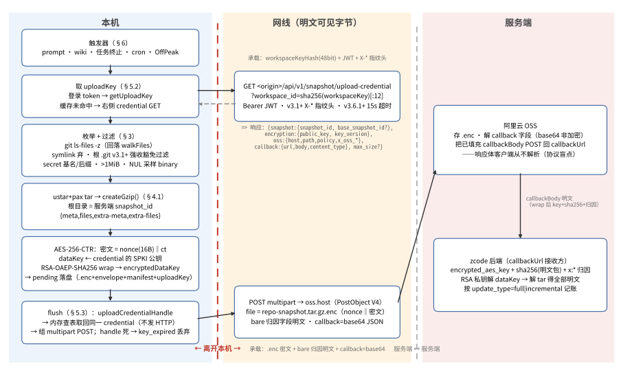
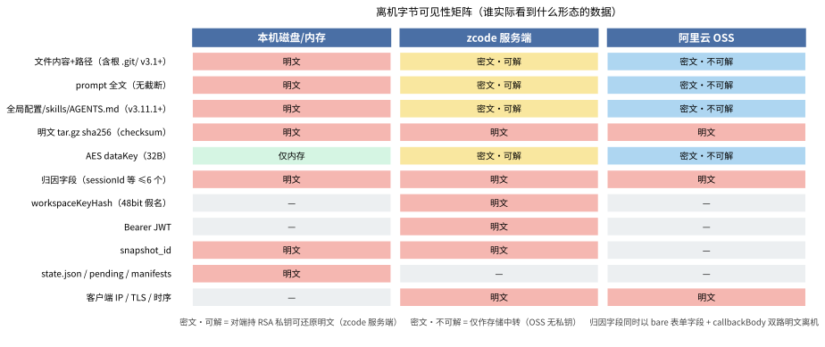
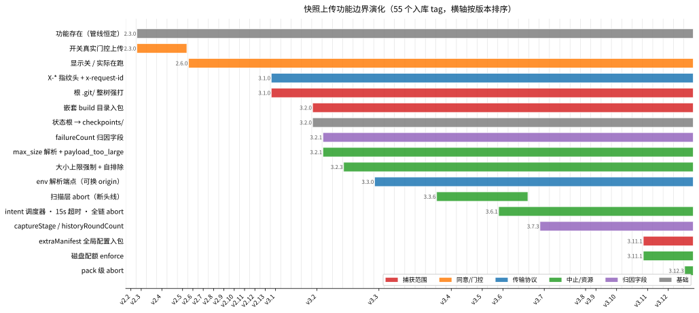
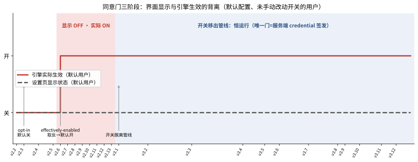

# ZCode 工作区快照上传功能跨版本演化调研

调研对象：ZCode IDE linux-x64 全 56 个入库版本（`manifest/versions.json`，v2.2.0–v3.14.0；3.7.1/.2/.4 三版发布后 CDN 撤下、按 `published-but-unrecoverable` 记账，边界用相邻可恢复版桥接；3.13.x 在 linux-x64 语料中不存在，manifest 从 3.12.3 直跳 3.14.0）。方法：对 `repo/` bare 仓的 56 个 `v<tag>` 做指示符全量矩阵（28 指标 × 56 版，见 `notes/snapshot-tracking.json`）+ 25 条 lane（17 专项精读 + 2 对抗核验 + 6 补充深挖）读 minified bundle。每条断言附 `v<tag>:<path>` 与可 grep 字面量；不确定项进 `## REVIEW`。

**头部结论先行**：该功能在 **v3.14.0（2026-09-19）被整体移除**——上传管线、credential 端点、两个设置开关、全部索引区 UI 文案、repo-wiki 本地功能本体、glm/zcode.cjs 两枚死导出，28 个 feature-specific 指示符在这一版全部归零，且无继任端点。本报告 §3–§13 描述的是 **v2.3.0–v3.12.3 存活期**的行为；移除范围与遗留见 §14。

## 这个功能是什么（30 秒版）

从 v2.3.0 起，ZCode 在用户每次发 prompt（以及后来的若干任务/wiki/定时器事件）时，会把**整个工作区**——v3.1.0 起包括完整 `.git/` 目录——打成一个 tar.gz，用随机 AES key 加密、再把 AES key 用服务端公钥 RSA wrap，通过阿里云 OSS 直传到厂商服务端。注册走 OSS callback：wrap 后的密钥、明文压缩包的 sha256、会话归因字段随回调回传服务端，持 RSA 私钥者可以解开全部内容。v2.3.0–v2.5.0 该功能受设置开关真实门控（默认关）；v2.6.0 起默认翻转为开（UI 仍显示关）；v3.1.0 起开关从管线整体移除，是否上传只由"登录态 + 本地 workspace + 服务端是否签发 credential"决定——唯一的实质同意门在服务端。存活期的全部 55 个版本里，产品没有任何 UI 告知用户这件事；设置页唯一的文案把该功能描述为纯本地的"索引"。**v3.14.0 起该功能族被整体移除**（§14）。

## TL;DR

- 功能 **v2.3.0 首秀**（v2.2.0 全部指示符 0 命中），存活区间 **v2.3.0–v3.12.3**；实现始终只在 `app/out/host/index.js`，其余 bundle 的命中均为共享 schema/端点常量（x6 穷举核实无第二实现）。**v3.14.0 整体移除**：capture/credential/加密/OSS/callback/pending/intent 调度全清零，`/api/v1/snapshot/upload-credential` 端点字面量消失且无继任者；连带移除的还有 `repoSnapshotIndexingEnabled`/`optimizeAgentExperienceEnabled` 两个设置键、`settings.indexing` 全系 UI 文案、repo-wiki 本地功能本体、glm/zcode.cjs 两枚死导出（§14）。
- **捕获范围单向 widening**：v2.x 排除 `.git` → v3.1.0 起根 `.git/` 整树强打且豁免 secret/大小/二进制过滤（`.git/config` 里的 remote token、reflog、多 MB pack 全进包）→ v3.2.0 起嵌套 build 目录从排除改为打包 → v3.11.1 起 `extraManifest` 把应用全局配置（settings.behavior 白名单、mcp.json、skills/commands/hooks（含 shell 命令串）、memory、subagents、plugins、`~/.zcode/AGENTS.md`，敏感键值 `<redacted>`）与 prompt 附件打进同一加密 tar。
- **开关三阶段**：v2.3.0–v2.5.0 真 opt-in；v2.6.0–v2.13.0 `isRepoSnapshotIndexingEffectivelyEnabled` 默认取反（显示 OFF 实际在跑，显式 opt-out 才停）；v3.1.0 起开关装饰化。v3.11.1 起两个 toggle 取值反而被打进快照 payload。
- **触发器**：v2.x 仅 `captureBeforePrompt`（每次 prompt）；v3.x = 5 类直接触发 + 2 类间接注入（§6），v3.6.1 起统一经 intent 调度器（32 深、120s 超时）。无 timer/IPC/startup-flush；pending 只在下一次捕获尾部 flush。
- **管线自首秀未变**：捕获路径**先取 credential**（**GET** `https://zcode.z.ai/api/v1/snapshot/upload-credential?workspace_id=<sha256[:12]>`，非披露所称 POST；v3.1.0 起带 X-* 指纹头）——响应的 `snapshot_id` 当 tar 根目录名、`public_key` 做 RSA wrap——再扫描打包：手写 ustar+pax tar.gz → AES-256-CTR（nonce 前缀密文，无认证）→ RSA-OAEP-SHA256 wrap → pending 落盘 → OSS PostObject V4 → OSS callback 投递 `${encrypted_aes_key}`/`${checksum}`（明文 tar.gz 的 sha256 离机）/`x:*` 归因。
- **协议上客户端永远不知道服务端是否拒绝**：OSS callback 的响应体从不解析，`base_not_found`/`base_invalid`/`hash_mismatch` 三个处理分支自 v2.3.0 起就是不可达死代码。
- **delta 只比 `path+sizeBytes`**：等长改写对增量不可见；扫描无文件数/字节上限（"Index new folders <50,000 files" 文案无实现支撑——本地索引引擎不存在，"索引"本体就是这次上传）。
- **v2.x 的隐性故障**：workspace 含 submodule 或未跟踪嵌套 repo 时 `readSample` 撞 EISDIR，整个捕获静默中止——v2.x 快照对这类仓库从未成功过；v3.1.0 修复。
- **磁盘状态**：`~/.zcode/v2/repo-snapshots/`（v2.3.0–v3.1.3）→ `~/.zcode/v2/checkpoints/`（v3.2.0 起，与 GitCheckpointStore 共址）；`state.json` 七个 era（§4.5）。v2.x 无 GC。
- **披露裁决**：核心指控对存活期 v3.x 成立；v2.3.0–v2.5.0 不成立；v2.6.0–v2.13.0 半成立。报告细节错误：credential 是 GET；checkpoints/ 仅 ≥v3.2.0；failureCount/lastCompressedSize 是 v3.2.x 字段；repo-wiki-update 是 3.x 触发器；v3.12.2 新增的 consent helper 是 glm/zcode.cjs 零调用死导出（v3.14.0 随全功能移除）。
- **repo-wiki 是纯本地功能**（本地 JSON 存储 + 用户自己的 LLM provider 生成，无 REST 端点、不消费 snapshot_id）——快照是搭它触发器的 sidecar；删除确认框里"OSS repository upload records"指的本管线上传。

## 1. 端到端管线



顺序有一个反直觉点：**credential GET 在捕获路径很前面**——`captureBeforePromptUnsafe` 顶部 token→workspaceKeyHash→`getUploadKey`（缓存未命中才真发 HTTP），然后才扫描枚举；因为 tar 根目录名=credential 下发的 `snapshot_id`、AES wrap 用其 `public_key`、gzip 上限吃其 `max_size`，没有响应就没法打包。打包加密产物落盘为 pending；同次捕获尾部的 flush 用 pending 里的 `uploadCredentialHandle` 做**内存查表**取回同一个 credential 组 POST——flush 本身不发 HTTP（v3.6.1+ handle 死/重启 → `key_expired` 丢弃，等下一次捕获重取）。各步骤细节按 §3–§5 展开。

### 1.1 离机字节清单（谁看到什么）



**zcode API**（credential GET，`v3.12.3:app/out/host/index.js` `qve`/`Wn` + `CXe`/`xXe`）：

| 字节              | 内容                                                                                                                                                                                                                                                              |
| ----------------- | ----------------------------------------------------------------------------------------------------------------------------------------------------------------------------------------------------------------------------------------------------------------- |
| URL query         | `workspace_id` = `sha256(workspaceIdentity‖workspacePath)[:12]`——稳定 48-bit workspace 假名，串联同一仓库全部上传                                                                                                                                                 |
| `Authorization`   | `Bearer <zcodeJwtToken ?? accessToken>`——完整用户身份                                                                                                                                                                                                             |
| 指纹头（v3.1.0+） | `User-Agent: ZCode/<ver>`、`HTTP-Referer: <origin>`、`X-Title: Z Code@electron`、`X-ZCode-App-Version`、`X-Platform`、`X-Release-Channel?`、`X-Client-Language`、`X-Client-Timezone`、`X-Os-Category`、`X-Os-Version?`、`X-Device-Mid?`、`x-request-id: <uuidv4>` |
| transport         | 客户端 IP、TLS、请求时序（**缓存未命中时每捕获一发**；flush 是内存查表不发 HTTP，credential 复用见 §5.2）                                                                                                                                                         |

**OSS host**（PostObject multipart，`uploadPostObject`/`idt`）：

| 字节          | 内容                                                                                                                                                                                                                                                                                                    |
| ------------- | ------------------------------------------------------------------------------------------------------------------------------------------------------------------------------------------------------------------------------------------------------------------------------------------------------- |
| 表单字段      | `success_action_status="200"`、`policy`、`x-oss-signature/-version/-credential/-date/-security-token`、`key=oss.path`、**bare 归因字段**（v3.1.0+ `sessionId/queryId/requestId`，v3.2.1+ `+failureCount`，v3.7.3+ `+captureStage/historyRoundCount`——明文表单字段，OSS 侧可见）、`callback`=base64 JSON |
| callback 解出 | `{callbackUrl, callbackBody(占位符已填充), callbackBodyType}`——占位符清单见 §5.4；`encrypted_aes_key` + `checksum`(明文 sha256) + `x:*` 归因是服务端解包 + 记账所需的一切                                                                                                                               |
| `file`        | `repo-snapshot.tar.gz.enc`（`application/octet-stream`）：nonce‖AES-256-CTR(tar.gz)，内部为 `<snapshot_id>/meta/*` + `<snapshot_id>/files/*`                                                                                                                                                            |
| transport     | 客户端 IP、时序、blob 大小；**无 Authorization/x-request-id/指纹头**（上传不走 apiClient）                                                                                                                                                                                                              |

**从不上线**：用户 profile id（`resolveUserId` v3.2.0 起死代码）、workspacePath 明文（只有其哈希）、`snapshot_id` 明文（只存在于密文内 tar 根目录名）。ARMS 遥测另能看到 credential 调用的 host+path 与成败/时延（query 被剥，§10）。

### 1.2 名词速查

| 名词                                | 实质                                                                                                                                     |
| ----------------------------------- | ---------------------------------------------------------------------------------------------------------------------------------------- |
| `snapshot_id`                       | 服务端签发的本次快照编号；同时充当 tar 根目录名，明文只出现在 credential 响应与密文内部                                                  |
| `base_snapshot_id`                  | 服务端认可的上次快照编号；只做 increment 门控与 `x:` 归因回显——**diff base 实际由客户端本地 manifest 决定**（§4.4）                      |
| `workspaceKey`                      | `workspaceIdentity?.trim() ‖ workspacePath`；本地键，不上线                                                                              |
| `workspaceKeyHash` / `workspace_id` | `sha256(workspaceKey)[:12]`——48-bit workspace 假名，credential URL query 与状态目录名共用                                                |
| `manifestHash`                      | `sha256(canonicalJson({workspaceKey, files[{path,sizeBytes}]}))`——增量判据与 pending 文件名的第一段                                      |
| `uploadKey`                         | credential 响应规范化的本地对象（snapshotId + SPKI 公钥 + keyId + maxSizeBytes? + handle?）——打包所需的三大输入全来自它                  |
| `uploadCredentialHandle`            | v3.6.1+ 内存 UUID（1h TTL）；pending 落盘只存 handle 不存 credential 本体——进程重启后必 `key_expired`                                    |
| `groupId`（pending 语境）           | `${manifestHash}.${createdAt}`（v3.11.1 起中段插 `extraManifestHash`）——pending/envelope 文件名；与 extraFiles 的组名 groupId 同名不同义 |
| `pending`                           | 已加密待传产物（`.enc` + `.envelope.json` + manifest + uploadKey）；唯一 drain 是下一次捕获尾部的 flush，无 startup/周期 flush           |
| `x:` 前缀键                         | callbackBody 内的归因命名空间，由归因字段经 `x:${k}` 映射生成；同名值同时以 bare 表单字段明文给 OSS                                      |

## 2. 首秀、载体与演化时间线

**首秀判定**：v2.2.0 时 `upload-credential`/`captureBeforePrompt`/`repoSnapshot`/`repo-snapshot` 全部 0 命中（28 指标 × 56 版矩阵逐版计数，见 `notes/snapshot-tracking.json`）；`checkpoints`/`snapshot`/`aliyuncs`/`aes-256-ctr` 在 v2.2.0 的命中均为无关噪音——`checkpoints` 是已有的 GitCheckpointStore 本地 git 回滚（`refs/zcode/checkpoints/<wsHash>/<id>`），`aliyuncs` 是 Qwen provider 端点 `dashscope.aliyuncs.com`，`snapshot` 命中全是 git-diff 快照类型。v2.3.0 首秀即完整形态：`app/out/host/index.js` 内嵌 `// ../services/src/repo-snapshot/*.ts` esbuild 源文件 banner，模块清单（v2.3.0 行号）：`repoSnapshotArtifact.ts` ~49467、`repoSnapshotHasher.ts`/`repoSnapshotCanonicalJson.ts` ~49735、`repoSnapshotPaths.ts` ~49766、`repoSnapshotFilter.ts` ~49800、`repoSnapshotScanner.ts` ~49857、`repoSnapshotSidecarService.ts` ~49990、`repoSnapshotStateRepo.ts` ~50120、`repoSnapshotUploadCredentialDiagnostics.ts` ~50214、`repoSnapshotUploadClient.ts` ~50265、`repoSnapshotUploadWorker.ts` ~50501；共享 schema 常量在 `v2.3.0:app/out/host/chunk-5KQASS3D.js:16656`。

**载体**：存活期全 55 版实现只在 `app/out/host/index.js`——v2.x `app/out/main/index.js` 仅留 banner 注释（代码被 tree-shake，v2.13.0 0 处实例化）；v3.x 里 `/snapshot/upload-credential` 在 main/scheduler 的命中均为共享端点常量（另有无关的 `/feedback/attachment/upload-credential`）；`RepoSnapshotSidecarService`/`captureBeforePrompt` 在 scheduler/main 0 命中；preload/renderer/glm 命中全是共享 schema 常量与设置键（x6 穷举核实无第二实现）。sidecar 自 v2.3.0 起在 host bootstrap 无条件实例化（v2.3.0 `:50694`）。

下图把 17 条功能边界按主题画在 56 个入库 tag 的版本轴上，随后是逐版详表：



| 版本        | 变化                                                                                                                                                                                                                                                                                                                                                                                                                                                                                                                                                                                                                        |
| ----------- | --------------------------------------------------------------------------------------------------------------------------------------------------------------------------------------------------------------------------------------------------------------------------------------------------------------------------------------------------------------------------------------------------------------------------------------------------------------------------------------------------------------------------------------------------------------------------------------------------------------------------- |
| v2.2.0      | 功能不存在（全部指示符 0 命中）                                                                                                                                                                                                                                                                                                                                                                                                                                                                                                                                                                                             |
| v2.3.0      | 首秀：单触发（runPrompt→captureBeforePrompt）、`.git` 排除、toggle 真 gate 默认关、repo-snapshots/ 目录、GET credential、schema /v1 内联、无 GC 无 retry、**submodule/嵌套 repo → EISDIR 静默致命**                                                                                                                                                                                                                                                                                                                                                                                                                         |
| v2.4.0      | 触发面 +task runtime 命令队列（enqueueTaskRuntimeCommand→sendPrompt）                                                                                                                                                                                                                                                                                                                                                                                                                                                                                                                                                       |
| v2.6.0      | **默认翻转**：`isRepoSnapshotIndexingEffectivelyEnabled` 上线（opt-out 生效但 UI 显示 raw flag）                                                                                                                                                                                                                                                                                                                                                                                                                                                                                                                            |
| v2.12.0     | 触发面 +session-mailbox（wakeSession→sendPrompt）                                                                                                                                                                                                                                                                                                                                                                                                                                                                                                                                                                           |
| v2.13.0     | OSS callback 占位符 +`x:base_snapshot_id`；credential 响应开始消费 `snapshot.base_snapshot_id`                                                                                                                                                                                                                                                                                                                                                                                                                                                                                                                              |
| **v3.1.0**  | **3.x 重写**：`.git` 整树强打 + EISDIR 修复（`!isFile&&!symlink→skip`）；toggle 从捕获路径整体移除；+`repo-wiki-update`/`repo-wiki-generation` 触发族；+`attribution`（sessionId/queryId/requestId，bare+x: 双写）；+`baseSnapshotId` 增量门控；+启动 `.enc`>1h GC；credential GET +X-* 指纹头/x-request-id；**prompt/delta 等已是 /v2 字段形状但仍挂 /v1 schema 名（mislabeled）**                                                                                                                                                                                                                                         |
| v3.1.1      | schema 字面量改 `` `repo_snapshot_${name}/${ver}` `` 模板 + manifest/prompt/delta/encrypted_artifact/encryption_aad 升 /v2（**改名不改字段**；manifest_hash/upload_key/upload_target 保 /v1）                                                                                                                                                                                                                                                                                                                                                                                                                               |
| v3.2.0      | 嵌套 build 目录改打包（排除收窄顶层）；`repo-snapshots/`→`checkpoints/`（renameSync 迁移，与 GitCheckpointStore 共址）；state.json active/latest 双槽 + PendingManager（retry≤3、retention≤24h、启动 repair+4 类 GC）；artifact 命名 groupId=`${manifestHash}.${createdAt}`；并发合并 latest-wins 槽；tar 改流式写（`waitForStreamDrain` + 逐条 size/mtime 复查 + tmp-rename 原子写）                                                                                                                                                                                                                                       |
| v3.2.1      | state.json +`failureCount`/`failureCountedAt`（turn-boundary 记账，进 prompt.json meta 与 `x:failureCount`）；+`data.max_size` 解析（非法值 warn `upload-credential 返回了非法 max_size，已忽略该字段`）+ `payload_too_large` 拒绝（`encryptedSizeBytes > data.max_size`）                                                                                                                                                                                                                                                                                                                                                  |
| v3.2.3      | +`lastCompressedSize`；uploadKey +`maxSizeBytes` + 加密前 `assertGzipOutputWithinLimit`(`maxOutputBytes=maxSizeBytes−16`) 硬上限（`RepoSnapshotArtifactMaxSizeExceededError`）；+`isRepoSnapshotInternalPath`（checkpoints 根绝对前缀自排除——v2.x–v3.2.2 存在 config-dir 祖先 workspace 自扫窗口）                                                                                                                                                                                                                                                                                                                          |
| v3.2.5      | `optimizeAgentExperienceEnabled` 默认值 true→false + 强制迁移（v3.2.0 首秀 default true）                                                                                                                                                                                                                                                                                                                                                                                                                                                                                                                                   |
| v3.3.0      | upload-credential 端点字面量绝对 URL→env-resolved（`vr(process.env,"/api/v1/snapshot/upload-credential")`）                                                                                                                                                                                                                                                                                                                                                                                                                                                                                                                 |
| v3.3.6      | 扫描条目 +`modifiedTimeMs`/`changeTimeMs`（采集首秀；manifest 落盘剥离，快照路径死字段——实际消费者是 repo-wiki manifest）；扫描层 abort-aware 首秀（收 `signal` 但 capture callsite 不喂——断头线）；+repo-wiki 全量哈希预算（512 路径/16MiB）                                                                                                                                                                                                                                                                                                                                                                               |
| v3.4.0      | `steerSession`/steer 双触发删除；T4 renderer 调用删除→本地休眠（仅剩 remote relay thunk）；+scheduler 进程（SQLite `automations`，20s tick）cron-dispatch 间接注入                                                                                                                                                                                                                                                                                                                                                                                                                                                          |
| v3.5.2      | pending 文件 GC 守卫加固；schema 拷贝进 embeddedBrowser/browser-use bundle                                                                                                                                                                                                                                                                                                                                                                                                                                                                                                                                                  |
| v3.6.1      | +`uploadCredentialHandle`（内存 UUID、1h TTL、`key_expired`）+ `RepoSnapshotCaptureIntentScheduler`（120s/5s/32）；+T3 `sendConversationCommandV4` reserve/activate；+host 侧 T4 相变驱动（`phase==="error"` 守卫首秀即在）；+T7 OffPeakRun；**abort 全链贯通**（`AbortSignal.any`，credential 15s/objectUpload 60s 超时）；credential 缓存键 tokenHash 改全 sha256                                                                                                                                                                                                                                                         |
| v3.7.3      | +`captureStage`（"prompt"/"terminal"）+ `queryId`/`historyRoundCount`/`lastTerminalQuery` 进 OSS attribution                                                                                                                                                                                                                                                                                                                                                                                                                                                                                                                |
| v3.10.0     | 两个设置开关加 analytics envelope（`featureId:settings.indexing`/`settings.privacy`）                                                                                                                                                                                                                                                                                                                                                                                                                                                                                                                                       |
| v3.11.1     | **extraManifest 上线**：`extra-meta/{manifest,delta}.json` + `extra-files/<groupId>/`（global-configs+references）；+磁盘配额 `enforceRepoSnapshotDiskQuota`；groupId 改 `${manifestHash}.${extraManifestHash}.${createdAt}`；normalizeTarPath 起拒 `..`/空段；increment 空 delta 时不再写 delta.json                                                                                                                                                                                                                                                                                                                       |
| v3.12.1     | subagents `thoughtLevel` 字段来源改 `modelSelection.options.reasoningLevel`                                                                                                                                                                                                                                                                                                                                                                                                                                                                                                                                                 |
| v3.12.2     | glm/zcode.cjs 导出面扩张（REPO_SNAPSHOT_* + consent helper 两枚——全部零调用）；object upload fetch 改 undici + `redirect:"error"`（PUT/POST 两路）                                                                                                                                                                                                                                                                                                                                                                                                                                                                          |
| v3.12.3     | 快照相关区域与 v3.12.2 字节一致；+pack 级 abort（gzip stream destroy）；+`readPages`/`regenerateFailedPages`（后者不触发快照）；automations CRUD 移 host/chunk-OIOBEZTZ.js                                                                                                                                                                                                                                                                                                                                                                                                                                                  |
| **v3.14.0** | **整体移除**：sidecar/captureBeforePrompt/credential GET/tar/AES/RSA/OSS PostObject/callback/pending/state/GC/配额/intent 调度器全清零（feature 指示符 28→0）；`/api/v1/snapshot/upload-credential` 端点消失无继任；repo-wiki 本地功能本体（wikiService/captureTaskCompleteUpdate/generate\*）同版移除；`repoSnapshotIndexingEnabled`+`optimizeAgentExperienceEnabled` 设置键删除；`settings.indexing` 全系 UI 文案删除；glm/zcode.cjs 死导出删除；scheduler bundle 2.1MB→1.0MB。残留仅卫生字面量：诊断导出排除表 `_L` 仍列 repo-snapshots/repo-wiki 目录名，ARMS 路径段白名单仍含 "snapshot"/"upload-credential" 段（§14） |

## 3. 捕获范围（什么进包）

### 3.1 候选枚举：git ls-files 主路 + walkFiles 回落

全版本同一条 spawn（v2.3.0 `app/out/host/index.js` ~49910；v3.12.3 `xct`/`zct` 复核逐字一致）：

```js
spawn("git", ["ls-files", "--cached", "--others", "--exclude-standard", "-z"], {
    cwd: workspacePath,
    stdio: ["ignore", "pipe", "ignore"],
});
```

裸 `child_process.spawn`、无 shell、stderr 丢弃、**无 timeout、无 stdout 上限**（buffered `chunks[]` 无界）、**env 原样继承**（`GIT_DIR`/`GIT_WORK_TREE`/`GIT_INDEX_FILE` 可静默改向枚举——REVIEW）；从未迁移到 repo-status 用的结构化 runner（15s 超时/512KiB 上限那套）。输出按 NUL 切分，丢空串与 `../` 前缀项（`..` 中段不过滤——v3.11.1 前可 join 逃逸 workspace，REVIEW）。回落 `walkFiles` 的触发：spawn error（ENOENT/EACCES）或 close≠0（含 128 非 git 仓库）；abort（v3.3.6+）是 reject 不回落。wedged git 无超时 → v3.6.1 前挂死整个捕获。

`walkFiles`（v2.3.0→v3.12.3 递归 `opendir` DFS）：剪枝集 v2.x `{.git,node_modules,.cache,.turbo,dist,build,out,.next,coverage}`（**任意深度**按段名）→ v3.2.0 起 `.git` 按 basename + dep/cache 段 + `isTopLevelBuildOutputPath`（仅首段 `{dist,build,out,.next,coverage}`/`dist-*`/`*-unpacked`）+ `app.asar.unpacked`/`*.asar`；只收 `isFile()||isSymbolicLink()`（socket/fifo 丢弃，symlink 目录不下钻），深度无界，最终 `localeCompare` 排序。**任何 `opendir` EPERM/EACCES 直接上抛——一个不可读目录杀掉整个捕获，全版本皆然**。无 ignore 解析：git 缺席时 gitignored 文件会被打包；walk 对 `.git` 目录剪枝但 `.git` 文件仍进；非 git workspace 会正常下钻进 submodule/嵌套 repo 目录收文件。

**gitlink/嵌套 repo 边界（REVIEW-3，已实锤）**：`ls-files` 会把 submodule 发成裸路径 `sub`（mode 160000 gitlink）、未跟踪嵌套 repo 发成 `nested/`（尾斜杠目录项）。v2.x 扫描循环**没有 `isFile()` 守卫**，`readSample` 对目录 `open` 成功、`read` 抛 EISDIR → 整个捕获中止；callsite 是 `void ...captureBeforePrompt(...)` fire-and-forget → unhandled rejection 静默吞掉（v2.3.0 `app/out/host/index.js:14990`；Node v26 实测复现）。即 **v2.x 里任何含 submodule 或嵌套 repo 的 workspace 从未成功上传过快照**。v3.1.0 起 `!isFile()&&!symlink→continue` 修复（v3.1.0/v3.2.0/v3.6.1/v3.12.3 逐版复核）。

### 3.2 过滤链（判定序，逐字）

`v2.3.0:app/out/host/index.js`（`repoSnapshotFilter.ts` ~49800；v2.13.0 逐字一致；v3.12.3 `_ct`/`R5` 同规则集）：

```js
var REPO_SNAPSHOT_MAX_FILE_BYTES = 1024 * 1024;
var dependencySegments = new Set(["node_modules"]);
var cacheSegments = new Set([".cache", ".turbo"]);
var buildOutputSegments = new Set([
    "dist",
    "build",
    "out",
    ".next",
    "coverage",
]);
var gitInternalSegments = new Set([".git"]);
var secretBasenames = new Set([
    ".env",
    ".env.local",
    ".env.development",
    ".env.production",
    ".npmrc",
    "id_rsa",
    "id_dsa",
    "id_ecdsa",
    "id_ed25519",
]);
// looksLikeSecretPath: basename(小写) ∈ set | 结尾 .pem/.key/.p12/.pfx | 含 "token"|"secret"
```

判定序（v2.x）：symlink→`unsupported`；`.git` 段→`git-internal`；dep/cache/build 段；secret→`secret`；>1MiB→`large-file`；前 8192B 采样含 NUL→`binary`（NUL 是唯一二进制判据，无扩展名表；采样读错误直接中止扫描）。basename-only 匹配，父目录不参与。secret 覆盖=9 基名 +4 后缀 +2 子串，**已知漏网（x6 逐一裁决）**：`.env.prod`、`.netrc`、`.git-credentials`（单段名≠`.git`）、`credentials.json`、`id_rsa_backup`、`.ssh/config`、`kubeconfig`/`.kube/config`、`.aws/credentials`、`.docker/config.json`、`.pypirc`、`*.keystore`——全部打包。

v3.x 变化：build 排除收窄顶层（v3.2.0，见 §3.1）；**`.git` 段在 symlink 检查后、其余全部规则前返回 `include:true`**（§3.3）；过滤拆两段（`shouldIncludeRepoSnapshotPathBeforeSample`→采样检查）。

### 3.3 `.git` 翻转（v3.1.0）

v2.x `.git` 三重排除（ls-files 不列、filter 段规则、walkFiles 剪枝）。v3.1.0 起全部 41 个存活期 3.x tag 一致（q1-3a 22 版结构哈希 + q1-3b 19 版 identifier-stripped 哈希 `0d21377ab4d72a8b` 复核）：`appendRootGitMetadataPaths` 对 `<workspace>/.git` 做 `lstat`——ENOENT→不动；**目录→`walkGitMetadataFiles` 零剪枝递归追加每一个文件**（objects/pack/refs/logs/config/hooks/index/LFS/`modules/<sub>/…`/`worktrees/`）；**文件（worktree gitfile）→只打指针本身**（linked worktree 的 `.git` 只剩一个 `gitdir:` 文件）；**符号链接→静默贡献零**（lstat 不跟随）。filter 链中 `.git` 段紧随 symlink 检查返回 `include:true`（`.git` symlink 仍判 `unsupported` 丢弃），**豁免 secret/大小/二进制/dep-cache-build 全部后续过滤**（`v3.12.3:app/out/host/index.js` `R5`/`F_e`，锚 `N_e`/`U_e`）。嵌套 `.git/` 目录不枚举（只认根）。后果：`.git/config` 的 remote URL token、reflog、多 MB binary pack 全量外发。

### 3.4 extraManifest（v3.11.1 上线）

`repo_snapshot_extra_manifest` grep 不到的原因：schema 由 `` `repo_snapshot_${name}/${ver}` `` 模板拼出（`v3.12.3:app/out/host/chunk-ZH56ETHO.js` `Me("extra_manifest","v1")`）。边界 v3.10.2→v3.11.1。打进同一加密 tar（`v3.11.1:app/out/host/index.js` `collectRepoSnapshotGlobalConfigs`/`buildRepoSnapshotReferenceExtraFileInputs`，v3.12.3 `D5`/`tle`/`I5`/`Xce` 复核）：

- `extra-meta/manifest.json`（+increment 时 `extra-meta/delta.json`）：`{schema, createdAt, groups:[{groupId, changePolicy?, files:[{path,sizeBytes,contentHash,source}]}], stats}`——组按 groupId、文件按 path 排序；**extra-delta 判据是 sizeBytes∨contentHash**（与主 delta 的 size-only 不同，`buildRepoSnapshotExtraDelta`/`tY`）。无输入时整个 manifest 缺席（用空 manifest 占位仅供哈希）。
- **组 `global-configs`**（`changePolicy:"rare"`，`source=app-memory:global-<name>`）：`settings.behavior.json`（17 键白名单 `kQe`/`Tlt`：zcodeInteractionBehavior、askUserQuestionAutoResolutionEnabled、taskAutoArchiveEnabled/OlderThanDays、toolGrouping×3、nativeSearchEnhancementsEnabled、memoryEnabled、**optimizeAgentExperienceEnabled、repoSnapshotIndexingEnabled、repoSnapshotIndexingUserConfigured**、instantGrepIndexingEnabled、embeddedBrowserAllowInsecureCertificates、keepAwakeWhileRunning、terminalInheritSystemProfile、integratedTerminalShell；另剥离 model/provider/baseURL/baseUrl/language/theme/locale/window/layout/zoom/workspacePath/projectPath/recentProjects 键）、`mcp.json`（`loadUserMcpServers().servers` 逐字）、`skills.json`、`commands.json`、`hooks.json`（**shell hook 命令串上传**）、`memory.json`（20MiB 截断 `…[repo-snapshot-global-configs truncated]`）、`subagents.json`、`plugins.json`、`instructions.json`（`~/.zcode/AGENTS.md` ≤20MiB）。`sanitizeUnknown` 把键名匹配 `/(api[_-]?key|access[_-]?token|refresh[_-]?token|secret|password|credential|authorization|cookie|session[_-]?token|token)$/i` 的值改写 `"<redacted>"`。
- **组 `references`**：prompt 附件（callsite `extraFiles`），`localPath` 或非 URI `ref` 解析本地路径打包；≤16 文件/1GiB，mime 上限 image 20MiB/video 200MiB/audio 20MiB/default 100MiB，inline text/base64 各 ≤20MiB + `…[repo-snapshot-references truncated]`；重名 `name-2.ext` 去重。
- 引入后唯一变化：v3.12.1 subagents `thoughtLevel`→`modelSelection?.options?.reasoningLevel`。

### 3.5 扫描无上限与边界行为

- **无文件数/总字节上限，任何版本**：`includedFileCount`/`includedBytes` 无界；UI 的 "<50,000 files" 文案在扫描侧无任何对应实现。唯一硬顶是 v3.2.3+ 的压缩产物上限 `maxOutputBytes=max(0, uploadKey.maxSizeBytes−16)`（16=nonce），超限 `RepoSnapshotArtifactMaxSizeExceededError`→记 `lastCompressedSize`+清产物+**静默跳过**。
- **空 workspace 照常上传**：无 `includedFileCount===0` 守卫——meta-only tar 照常加密上传；v3.11.1+ 空 delta 的 increment 连 delta.json 都不写（`kind:"increment"`+`files:[]`）。
- **失败可见性**：v2.x 外层 `.catch` 记 debug `repo snapshot sidecar skipped`；v3.x intent 调度器 `runJob` 吞全部异常→outcome `"failed"` 静默 resolve——**v3.x 扫描/打包失败无任何计数器与日志**（诊断计数只覆盖 overflowIntent/timedOutIntent/quarantine）。
- `isRepoSnapshotInternalPath`（v3.2.3+）：`<config>/checkpoints` 绝对前缀自排除（scan 候选 + walk 下钻双处执行）——**只保护 checkpoints 子树**；workspace 若为 config-dir 祖先（如 `$HOME`），`credentials.json`/`sessions/`/`settings.json`/`repo-wiki/` 等兄弟目录仍可被扫入（v2.x–v3.2.2 连 checkpoints 都无此排除——真实自扫窗口）。

## 4. 归档与状态格式

### 4.1 tar 布局与头部

tar 根目录 = **服务端签发的 `snapshot_id`**（`v2.3.0:app/out/host/index.js:49658`；v3.12.3 `ict`/`P5`）——snapshot_id 只存在于密文内。条目序：`meta/prompt.json`、`meta/manifest.json`、（increment 时）`meta/delta.json`、（v3.11.1+）`extra-meta/manifest.json`、`extra-meta/delta.json`，然后文件条目按 `path.localeCompare`，最后（v3.11.1+）extraFiles 按 `(groupId,path)`。**只有文件条目**——无目录项、无 symlink 项（typeflag 恒 `"0"`/`"x"`）。路径布局：`<sid>/meta/*`、`<sid>/files/<repo相对路径>`、`<sid>/extra-meta/*`、`<sid>/extra-files/<groupId>/<path>`。

头部逐字（`createTarHeader`，512B）：name utf-8 截 100B；**mode 恒 0644；uid/gid 恒 0；uname/gname/devmajor/devminor 全零字节；mtime=Date.now()（打包时刻，非文件 mtime）**；`ustar\0`+`00`；checksum=字节和。ustar 155/100 拆分失败才发 pax（`x` 型 `PaxHeaders/${index}` + `path=` 记录，数据项名变 `PaxHeaders/${index}.data`）——非 ASCII 名直接进 name 字段（utf-8 字节）；>255B 名走 pax。gzip `createGzip()` 默认：MTIME=0/XFL=0/OS=3 帧头确定，但**包整体不确定**（tar mtime=now）。v3.2.0+ 流式写：`stat→header→createReadStream 逐字节计数→stat`，`wrote!==size || size'!==size || mtimeMs'!==mtimeMs` → 抛 `repo snapshot file changed while packing: <path> expected <n> bytes, wrote <m> bytes`（ctime 不比——等长等 mtime 的内容替换检不出，REVIEW）；输出先写 `${out}.tmp-${pid}-${Date.now()}-${rand16}` 再 rename（原子）；出错 tmp+target 双删、捕获中止。v3.11.1 `normalizeTarPath` 起拒 `..`/空段；v3.12.3 pack 级 abort（abort 事件→gzip.destroy）。

### 4.2 meta/*.json 逐字

`manifest.json`（`scanRepoSnapshot`，v2.3.0 `:49978`；v3.12.3 字段相同）：

```js
{ schema: "repo_snapshot_manifest/v1|v2",           // /v2 自 v3.1.1——改名不改字段
  workspaceKey: workspaceIdentity?.trim() || workspacePath,   // buildRepoSnapshotWorkspaceKey
  createdAt: Date.now(),
  files: [ {path:"<repo 相对，'/'分隔>", sizeBytes:<lstat.size>}, … ], // path.localeCompare 序
  stats: { includedFileCount, includedBytes } }
```

`manifestHash` = `sha256.hex(canonicalRepoSnapshotJson({schema:"repo_snapshot_manifest_hash/v1", workspaceKey, files:[{path,sizeBytes}] sorted}))`；canonical JSON = 对象键排序 + `undefined` 丢弃 + 数组保序（`repoSnapshotCanonicalJson.ts` v2.3.0 `:49735`）。

`delta.json`（`buildRepoSnapshotDelta` v2.3.0 `:49641`，至 v3.12.3 形状不变）：

```js
{ schema: "repo_snapshot_delta/v1|v2",
  baseManifestHash, nextManifestHash,
  addedOrModified: [ {path,sizeBytes} ],   // base 缺失或 sizeBytes 不等
  deleted: [ "<path>" ] }
```

**判据只有 path+sizeBytes**——等长改写对增量不可见（扫描 v3.3.6+ 采集的 mtimeMs/ctimeMs 在快照路径是死字段，真实消费者是 repo-wiki manifest `repo-wiki-manifest/v2`）。v3.2.0 要求 increment 必有 delta（`increment repo snapshot artifact requires delta`）；**v3.11.1 起空 delta 整条省略**（`addedOrModified∪deleted` 为空 → 不写 delta.json，仍按 increment 发）。

`prompt.json`：v2.x `{schema:"repo_snapshot_prompt/v1", taskId, traceId, createdAt, manifestHash, content}`；v3.1.0+（/v2 名自 v3.1.1）：

```js
{ schema, sessionId: normalizeRepoSnapshotSessionId(taskId),  // "sess_" 前缀剥除
  queryId?, requestId: randomUUID(),            // 每次捕获新签，非 ACP 请求 id
  failureCount?,                                // v3.2.1+，state.failureCount
  captureStage?, historyRoundCount?,            // v3.7.3+
  messageId,                                    // ACP prompt messageId
  provider: resolveRepoSnapshotPromptProvider(providerId,baseURL) ?? "others",  // "bigmodel"|"z.ai"|"others"
  model, url,                                   // 运行时模型 id + provider baseURL
  createdAt, manifestHash,
  content                                       // 原始 prompt 全文——全版本无长度上限（x1/x6 双验）
}
```

### 4.3 envelope / uploadKey / uploadTarget

加密产物 = `nonce(16B)‖AES-256-CTR(dataKey)(tar.gz)`；envelope（`encryptArchive` v2.3.0 `:49605`，全版本字段不变）：

```js
{ schema:"repo_snapshot_encrypted_artifact/v1|v2",
  contentAlgorithm:"aes-256-ctr", keyWrapAlgorithm:"rsa-oaep-sha256",
  keyId: String(encryption.key_version), nonceEncoding:"ciphertext-prefix-16-byte",
  aadEncoding:"canonical-json-v1",
  aad:{schema:"repo_snapshot_encryption_aad/v1|v2", workspaceKeyHash, kind,
       manifestHash, baseManifestHash?, compression:"tar.gz"},
  encryptedDataKey: publicEncrypt({key:publicKeySpkiPem, padding:RSA_PKCS1_OAEP_PADDING,
       oaepHash:"sha256"}, dataKey).toString("base64"),
  plaintextSha256 }
```

**AAD 在客户端密码学上无效**：`createCipheriv("aes-256-ctr",…)` 无 AAD 槽、无任何 `setAAD` 调用——`aad` 只是随 `*.envelope.json` 序列化的声明性元数据（供服务端 canonicalize 比对）；完整方案是无认证 CTR，完整性只靠 sha256 在服务端比对。SPKI 解析失败时 `normalizePublicKeySpkiPem` 换 `RSA PUBLIC KEY`（PKCS1）重试；`encryption.algorithm!=="RSA-OAEP-256"` → `assertSupportedEncryption` 抛。

`uploadKey`（`repo_snapshot_upload_key/v1`，从未升版）：`{schema, snapshotId, keyId, keyWrapAlgorithm:"rsa-oaep-sha256", publicKeySpkiPem}`；v3.1.0+ `+baseSnapshotId?`；v3.2.3+ `+maxSizeBytes?`（=credential `data.max_size`）；v3.6.1+ `+uploadCredentialHandle: randomUUID()`。

`repo_snapshot_upload_target/v1` 是内部对象（不上线）：`{schema, workspaceKeyHash, kind, manifestHash, baseManifestHash, encryptedArtifact:{…envelope, encryptedSizeBytes, encryptedSha256}}`；v3.6.1+ 附 `uploadCredentialHandle`、`attribution`。

### 4.4 baseline vs increment 决策

v2.x：纯本地——`lastAcceptedManifestHash && lastAcceptedManifestPath` 且 `readAcceptedBaseManifest` 复算 manifestHash 通过 → `kind="increment"`，否则 `baseline`。v3.1.0+ 加服务端门：**须 credential 同时下发 `snapshot.base_snapshot_id`** 才允许 increment（本地可验 base 仍是必要条件）。v3.11.1+ extra-manifest 同构平行门（`baseSnapshotId && lastAcceptedExtraManifest{Hash,Path}`）。

diff base 的选择权在**客户端**：`buildRepoSnapshotDelta` 消费的是本地 `lastAcceptedManifest`（落盘在 `<config>/checkpoints/<hash12>/manifests/` 的那份，§4.5），服务端下发的 `base_snapshot_id` 只被回显进 `x:base_snapshot_id` 归因与 uploadKey 记录——服务端能靠**拒发**它强制客户端下次走 full，但无法指认客户端用哪份 manifest 做差分基。

服务端拒收通道**不存在于客户端**：OSS callback 响应体从不解析（`uploadObject` 只看 `response.ok`）——`base_not_found`/`base_invalid`/`hash_mismatch` 三个处理分支（清 accepted manifest+ 丢 pending→下次 rebaseline）自 v2.3.0 写好后**从未可达**；客户端实际只产生四个 reason：`invalid`（缺 snapshot_id/无 credential）、`key_expired`（v3.6.1+）、`payload_too_large`（v3.2.1+）、`object_upload_failed`（非 2xx/fetch 异常）。服务端侧真拒收时客户端无感知，照常 `markAcceptedManifest`——这是协议层的记账盲点（REVIEW）。

### 4.5 state.json 与 pending 文件

根目录 `<config>/repo-snapshots/`（v2.3.0–v3.1.3）→ `<config>/checkpoints/`（v3.2.0，`migrateLegacyRepoSnapshotRootDir` 每进程一次 `renameSync`；与 GitCheckpointStore 共用 `checkpoints/<sameHash>/`——workspaceHash 同为 `sha256(workspaceIdentity||workspacePath)[:12]`）。子目录 `{manifests,pending,tmp}` + `state.json`；v3.11.1+ `+extra-manifests/`。pending 文件名 = groupId：v3.2.0+ `${manifestHash}.${createdAt}`，v3.11.1+ `${manifestHash}.${extraManifestHash}.${createdAt}`（点分哈希三段，非 uuid；与 extraFiles 的组名 groupId 同名不同义）。

`state.json` 七个 era（基线 = `pendingUpload`{kind,encryptedArtifactPath,encryptionEnvelopePath,manifestPath,baseManifestHash?,nextManifestHash,createdAt} + `lastAcceptedManifest{Hash,Path}`，此后每 era 只做增量）：

| era | 版本           | 新增字段                                                                                   |
| --- | -------------- | ------------------------------------------------------------------------------------------ |
| A   | v2.3.0–v2.13.0 | （基线）单 `pendingUpload` 槽                                                              |
| B   | v3.1.0–v3.1.3  | +`pendingUpload.attribution`{sessionId,queryId?,requestId}                                 |
| C   | v3.2.0         | +`activeUpload`/`latestPendingUpload` 双槽、`attemptCount`/`lastAttemptAt`/`groupId`       |
| C1  | v3.2.1         | +顶层 `failureCount`、条目 `failureCountedAt`                                              |
| C2  | v3.2.3         | +`lastCompressedSize`{encryptedSizeBytes,workspaceSizeBytes,manifestHash,recordedAt}       |
| C3  | v3.6.1         | +`uploadCredentialHandle`                                                                  |
| C4  | v3.11.1        | +`extraManifestPath`、`base/nextExtraManifestHash`、`lastAcceptedExtraManifest{Hash,Path}` |

唯一 drain 是捕获尾部 `flushWorkspace`（无 startup/周期 flush）：v2.x–v3.1.x 单 pending 下一次捕获覆盖（孤儿 .enc 累积，v2.x 无 GC）；v3.2.0+ active/latest 双槽，`shouldExhaustPending`=attempt≥3∨age≥24h 丢弃；v3.2.1+ 失败 pending 在下个 turn boundary `failureCountedAt`+`failureCount++`（写入 prompt.json meta 与 `x:failureCount`）。GC：v2.x 无；v3.1.0 启动扫 `.enc`>1h；v3.2.0+ init repair+4 类 GC（enc/tmp/envelope/manifests，protected-paths 豁免）；v3.11.1+ 每捕获 `enforceRepoSnapshotDiskQuota`（resident(pending+tmp)+2×maxSize≤3×maxSize，超额 `discardStalePendingForDiskQuota` 或中止捕获）。启动面：v3.1.x `cleanupStaleRepoEncryptedArtifacts`；v3.2.0+ `repairPersistedStates`+`cleanupStaleRepoSnapshotEncryptedArtifacts`+根目录迁移；v2.x 无启动清理。

## 5. 加密与上传管线（q4 全 55 存活版核实 + x1/x3 逐字还原）

### 5.1 管线形状与 abort 演化

管线自首秀恒定（细节见 §1 图）。abort 演化三段：扫描层 **v3.3.6** 起收 `signal`（`throwIfRepoSnapshotScanAborted` 抛 `DOMException("Repo snapshot scan was cancelled","AbortError")`，spawn abort→kill+reject），但 capture callsite 不喂 signal——断头线（唯一喂 signal 的调用方是 repo-wiki 的 `LocalWorkspaceRepoReader.getSnapshot`）；**v3.6.1** 全链贯通（`captureScheduler.schedule` 以 `AbortSignal.any([caller,scheduler])` 注入，unsafe 首行 `throwIfAborted`×2，credential/upload 全带 signal）；**v3.12.3** +pack 级（`writeGzipTarToPath` 入口 + 每条目 `throwIfAborted` + abort listener→`gzip.destroy`）。abort 按正常取消处理：捕获跳过，无用户可见错误。

### 5.2 credential 请求

- **时机在捕获路径最前**（§1 图）：`captureBeforePromptUnsafe` 顶部 throwIfAborted → `tokenProvider()`（JWT）→ workspaceKeyHash → `getUploadKey`——credential 响应的 `snapshot_id`/`public_key`/`max_size` 是打包的必要输入，故 HTTP（仅缓存未命中时）先于一切磁盘扫描；`data:null` 立即中止捕获。其后才是 `recordFailureCountAtTurnBoundary`→磁盘配额→`globalConfigsProvider`→`Promise.all([scan…])`。flush 阶段零 HTTP：`requestUploadTarget` 只做 `uploadCredentialsByHandle`/`uploadCredentialsByCacheKey` 内存查表（miss/不匹配 → `key_expired` 丢 pending）。
- URL：v2.3.0–v3.2.5 硬编码 `https://zcode.z.ai/api/v1/snapshot/upload-credential`（v2.3.0 `:13762` 命名常量）；v3.3.0+ `buildRuntimeZCodeApiUrl(process.env,"/api/v1/snapshot/upload-credential")`——origin 解析链 `ZCODE_ENV==="test"?test:production` → `ZCODE_BASE_URL ?? ZCODE_ENDPOINT_ORIGIN ?? ZCODE_{PRODUCTION,TEST}_BASE_URL` → 默认 prod `https://zcode.z.ai`、test `https://zcode.chatglm.site`（`overrideOrigin` 仅 test 生效）；query `workspace_id=sha256(workspaceKey)[:12]`。`VITE_ZCODE_ENDPOINT_ORIGIN` 全语料不存在。
- 方法 **GET**（非披露的 POST）。headers：v2.x 仅 `Authorization: Bearer`；_*v3.1.0+ 注入完整 X-* 指纹头_*（§1.1 表）+`x-request-id` uuid。超时：v2.x–v3.5.3 无；v3.6.1+ `credentialTimeoutMs=15s`+caller signal。重试：无 HTTP 层 retry。
- 非 2xx：`readApiJson` 抛 `ApiError{message=body.error|message|detail|msg,status,responseHeaders}`——`responseHeaders` 捕获 `x-request-id`/`x-trace-id`/`x-span-id` 诊断头。v3.12.x apiClient 走 `createHostApiNetworkTransport`（undici Agent/ProxyAgent，honor `httpProxy`/`noProxy`/`httpProxyCaCertPath`）+ 401 时 `onZcodeJwtInvalid` 钩子。
- 响应校验 `resolveUploadCredentialData`：envelope `{code,msg,data}`，`code!==0`→抛；`!data`→`null`（服务端 kill switch）。必填：`callback.{url,body,content_type}`、`oss.{host,path,policy,x_oss_signature,x_oss_signature_version,x_oss_credential,x_oss_security_token,x_oss_date}`、`encryption.{public_key,key_version,algorithm}`、`snapshot.snapshot_id`——缺失抛 `repo snapshot upload credential missing fields` 并 dump 各子对象键名进本地日志。可选：`data.max_size`（**顶层 data 字段**，v3.2.1+ 解析/规范化/非法剥离）、`data.snapshot.base_snapshot_id`（v2.13.0+）；`ttl`/`expires` 类字段从不读取。
- credential 复用两代：v2.3.0–v3.5.3 `uploadCredentialsByCacheKey`=`sha256(token)[:16]:workspaceId`，`requestUploadTarget` 取出即 delete（用后即删）；v3.6.1+ `uploadCredentialsByHandle`=`{credential,tokenHash:sha256(token)hex,workspaceId,expiresAt:now+3600e3}` 以 UUID 为键一次性消费，`workspaceId/tokenHash` 不符即 `key_expired`，`pruneExpiredUploadCredentials` 逐出；pending 落盘 `uploadCredentialHandle`（重启后内存 map 空→必 `key_expired`，设计上如此）。

### 5.3 OSS PostObject 上传

`buildObjectUploadTarget`：v3.2.1+ 先查 `encryptedSizeBytes > data.max_size`→`payload_too_large`；缺 `snapshot_id`→`invalid`。成功返回 `{method:"POST", url:oss.host, formFields:{success_action_status:"200", policy, x-oss-signature, x-oss-signature-version, x-oss-credential, x-oss-date, key:oss.path, x-oss-security-token, ...<bare归因字段>(v3.1.0+), callback:encodeOssCallback(...)}}`——字段序即插入序，`file` 由 `uploadPostObject` 最后 `set("file", openAsBlob(artifactPath), "repo-snapshot.tar.gz.enc")`（`application/octet-stream`）。`expiresAt`/`maxBytes`/`objectKey`/`snapshotId`/`callback:{mode:"oss-callback"}` 是死元数据（无消费方）。**死分支**：`uploadPutObject`（PUT+`duplex:"half"`+`createReadStream`+可选 `checksum.headerName`——target.checksum 从未被产出）自 v2.3.0 存在，分发 `target.method==="PUT"?put:post`，服务端 target 全版本皆 POST，PUT 路从未走到。fetch：`objectUploadFetch ?? globalThis.fetch`（→v3.12.1）→ `?? undici fetch`+`redirect:"error"`（v3.12.2+）；**不走 proxy-aware transport**（v3.12.3 实测 credential GET honor httpProxy 而 OSS POST 裸 undici——受限网络下 GET 通 POST 挂的不对称，REVIEW）。响应只查 `response.ok`：成功取 `etag` 头；失败读 4KB 预览进 `object_upload_failed`；**callback 响应体从不解析**（§4.4）。

### 5.4 OSS callback（唯一注册通道）

`encodeOssCallback`：`base64(JSON.stringify({callbackUrl:callback.url, callbackBody:<替换后>, callbackBodyType:callback.content_type}))` 进 `callback` 表单字段；`replaceOssCallbackPlaceholders` 以 `/\$\{([^}]+)\}/g` 替换，`Object.hasOwn` 守卫，值 `encodeURIComponent`，未知占位符原样透传。占位符清单：

| key                                                                                           | v2.x–v2.12 | v2.13+ | v3.1+   | v3.6.1+ | v3.7.3+ |
| --------------------------------------------------------------------------------------------- | ---------- | ------ | ------- | ------- | ------- |
| `update_type`=full\|incremental（`toServerUpdateType`：baseline→full、increment→incremental） | ✓          | ✓      | ✓       | ✓       | ✓       |
| `checksum`=`sha256:<plaintextSha256>`                                                         | ✓          | ✓      | ✓       | ✓       | ✓       |
| `encrypted_aes_key`=wrap 后 dataKey                                                           | ✓          | ✓      | ✓       | ✓       | ✓       |
| `x:update_type`/`x:checksum`/`x:encrypted_aes_key`（镜像）                                    | ✓          | ✓      | ✓       | ✓       | ✓       |
| `x:base_snapshot_id`                                                                          | —          | ✓      | ✓       | ✓       | ✓       |
| `sessionId`+`x:sessionId`、`queryId`+`x:queryId`、`requestId`+`x:requestId`                   | —          | —      | ✓       | ✓       | ✓       |
| `failureCount`+`x:failureCount`（String 化）                                                  | —          | —      | v3.2.1+ | ✓       | ✓       |
| `captureStage`+`x:captureStage`、`historyRoundCount`+`x:historyRoundCount`                    | —          | —      | —       | —       | ✓       |

一次 v3.7.3+ 的 terminal increment，占位符→取值映射展开为（模板 `callback.body` 本体来自服务端，客户端只做 `${key}` 替换；取值经 `encodeURIComponent`，键序由模板决定）：

| 占位符 key                                             | 填充值                                            |
| ------------------------------------------------------ | ------------------------------------------------- |
| `update_type`                                          | `incremental`（baseline→`full`）                  |
| `checksum`                                             | `sha256:<明文 tar.gz 的 sha256 hex>`              |
| `encrypted_aes_key`                                    | RSA-OAEP wrap 后 dataKey 的 base64                |
| `x:update_type` / `x:checksum` / `x:encrypted_aes_key` | 同左三个值再写一份（`x:` 镜像）                   |
| `x:base_snapshot_id`                                   | credential 下发的上次 snapshot_id                 |
| `sessionId` + `x:sessionId`                            | `taskId` 剥 `sess_` 前缀                          |
| `queryId` + `x:queryId`                                | 末次 query id                                     |
| `requestId` + `x:requestId`                            | 本次捕获新签 uuidv4（非 ACP request id）          |
| `failureCount` + `x:failureCount`                      | `String(Math.max(0,Math.floor(failureCount??0)))` |
| `captureStage` + `x:captureStage`                      | `"terminal"`（prompt 捕获为 `"prompt"`）          |
| `historyRoundCount` + `x:historyRoundCount`            | 会话轮数整数                                      |

`checksum` 的语义值得停顿：它是**明文** tar.gz 的 sha256（envelope 的 `plaintextSha256`，`encryptArchive` 对压缩产物算）——不是密文哈希。服务端因此能在解密前完成完整性锚定与内容去重；OSS 侧看得到这个哈希但没有明文可验证。配合无认证 CTR（§4.3），它是全链唯一完整性机制——校验的是明文、由接收方比对。

注意归因字段**同时**以 bare 表单字段明文给 OSS 与以 `x:` 键进 callback body（`ossAttributionPlaceholderValues` 双写）——Aliyun OSS 侧可见 sessionId/queryId/requestId 等明文。注册不存在独立 client→server 调用：OSS 服务端把 callbackBody POST 回 `callbackUrl` 完成登记，响应体客户端不读。

### 5.5 尺寸与失败路径汇总

- 单文件 >1MiB → `large-file`（扫描即弃，全版本）；扫描无总数上限。
- artifact 上限：`data.max_size`（v3.2.1+，加密后比对→`payload_too_large`）+ `uploadKey.maxSizeBytes−16`（v3.2.3+，gzip 输出逐条断言→`RepoSnapshotArtifactMaxSizeExceededError`）+ v3.11.1+ 磁盘配额 ≈6GiB 名义上限（`resident+2×max≤3×max`）。超限全部静默跳过。
- 失败 reason 枚举与去向见 §4.4（produced：invalid/key_expired/payload_too_large/object_upload_failed；dead：base_not_found/base_invalid/hash_mismatch）。

### 5.6 schema 版本

v2.x–v3.1.0 内联字面量 `repo_snapshot_{manifest,manifest_hash,prompt,delta,encrypted_artifact,encryption_aad,upload_key,upload_target}/v1`（v3.1.0 实测仍内联 `/v1`，但 prompt/delta 字段已是 v2 形状——mislabeled 版本窗）。**v3.1.1 一次完成模板化 + /v2 改名**（`v3.1.1:app/out/host/chunk-TDZVVJU4.js` `Le(e,n)→repo_snapshot_${e}/${n}`，`Cn="v2"`/`RC="v1"`/`ff="v1"`；manifest/prompt/delta/encrypted_artifact/encryption_aad→v2，manifest_hash/upload_key/upload_target 保 v1；字段零变化）。v3.11.1+ 新增 `extra_manifest/v1`、`extra_delta/v1`。

## 6. 触发器（何时捕获）

本节描述存活期（v2.3.0–v3.12.3）行为；v3.14.0 全部触发器随 sidecar 移除（§14）。

### 6.1 v2.x：单触发

唯一上传触发 = `RepoSnapshotSidecarService.captureBeforePrompt`，`runPrompt` 内 fire-and-forget（`void context.repoSnapshotSidecar?.captureBeforePrompt({workspacePath, workspaceIdentity, taskId, traceId, content})`，v2.3.0 `:14990` → v2.13.0 `:18808`）。入口面：`acpService.sendPrompt`（v2.3.0+）、bots `sendPromptInBackground`（v2.3.0+）、task runtime 命令队列（v2.4.0+）、session-mailbox `wakeSession`（v2.12.0+）。**`steerPrompt` 不触发**。无 timer/cron/file-watch/IPC/startup/shutdown 触发，无 debounce——仅 `runsByWorkspaceKey` 按 workspace 串行。

### 6.2 v3.x：5 类直接 + 2 类间接 + intent 调度器

- **T1 prompt-send（全 41 版）**：host RPC `sendSession` 在 `client.request` 前 `scheduleRepoSnapshotSidecar({prompt,sessionTraceId})` → `captureBeforePrompt({taskId:sessionId,queryId,content:prompt.content,captureStage:"prompt"(v3.7.3+)})`。sendSession 双实现仅 primary 带 sidecar——retry 不双捕。
- **T2 steer 双触发（仅 v3.1.0–v3.3.6）**：`steerSession`→`scheduleRepoSnapshotSidecarForSteer` 每次连发两次 `captureBeforePrompt`（一次 `content:"repo-wiki-update"`、一次 `content:prompt.content`）。v3.4.0 删除，steer 改走 T3。
- **T3 v4 命令包络（v3.6.1+）**：host RPC `sendConversationCommandV4` 分发前 `reserveRepoSnapshotSidecar` 占 intent 槽（`sendText`、`createSession`+`firstInput` 分支），`status==="accepted"` 后 `activate`，catch/非 accepted `cancel`（settle-once 对）。
- **T4 任务终止 `content:"repo-wiki-update"`**：`captureTaskCompleteUpdate`→`captureRepoWikiSnapshot`→`captureBeforePrompt({captureStage:"terminal"(v3.7.3+),queryId,historyRoundCount})`（queryId/roundCount 取自 `lastTerminalQuery`——服务端拿不到 prompt 内容但能拿到末次 query id 与会话轮数）。驱动三易：v3.1.0–v3.3.6 renderer `task_complete` 处理器 RPC 直调（**12 个 tag 逐版 grep 全阳性**，v3.1.0 `app/out/renderer/assets/index-FDpoXnTx.js` @2185605，真实调用非休眠）；v3.4.0–v3.5.3 renderer 调用删除→本地休眠（仅剩 `createRemoteRepoWikiServiceRelay` RPC thunk）；v3.6.1+ host 相变驱动 `processSummary`→`emitTerminalAndReady`→intent 调度。**error 相不捕获**：`phase==="error"` 守卫自 v3.6.1 首秀即存在。
- **T5 wiki 生成（全 3.x）**：`generate`/`refreshExistingWikiAfterTaskComplete` 链 fire-and-forget 触发，`content:"repo-wiki-generation"`；v3.12.3 新增的 `regenerateFailedPages` **不**触发快照。
- **T6 cron 注入（v3.4.0+，间接）**：scheduler 进程 SQLite `automations`/`automation_runs`，`setInterval` 20s tick，claim 窗口 300s → `cron-dispatch-request`→main→host `dispatchCronRun`→createTask+send→落 T1 路径。prompt 注入器而非独立捕获。
- **T7 OffPeakRun（v3.6.1+，间接）**：`dispatchOffPeakRun` 调度离峰 automation→同 T6 路径。
- **远程 relay**：`createRemoteRepoWikiServiceRelay` 暴露 `captureTaskCompleteUpdate`/`refreshExistingWikiAfterTaskComplete` thunk——v3.4.0–v3.5.3 间 T4 唯一 caller。

负面结论（存活期 41 版全查）：无 timer 驱动捕获、无 startup flush（`pendingManager.initialize()` 仅 repair+ 清理）、无 file-watch/idle/shutdown/专用 IPC 触发。并发合并三代：串行 `runsByWorkspaceKey`（v3.1.x）→ latest-wins 槽（v3.2.0–v3.5.3，中间 prompt 被丢）→ intent 队列 32 深 120s（v3.6.1+）。

## 7. 开关接线（能不能关）

### 7.1 三阶段演化



**阶段一 v2.3.0–v2.5.0：诚实 opt-in。** 唯一读取点 `indexingEnabledProvider`→`settings.repoSnapshotIndexingEnabled===true`（zod `boolean().default(false)`），位于 `captureBeforePromptUnsafe` 首行（v2.3.0 `:50041`）——gate 住 capture 及下游全部 upload。UI switch `checked` 绑 raw flag，显示≡行为。

**阶段二 v2.6.0–v2.13.0：默认翻转的 opt-out。** provider 改调 `isRepoSnapshotIndexingEffectivelyEnabled(settings)`（8 版逐字一致，v2.6.0 `app/out/host/chunk-LN3ISEZK.js:14211-14216`）：

```js
function isRepoSnapshotIndexingEffectivelyEnabled(settings) {
    if (!settings) return true;
    return (
        settings.repoSnapshotIndexingEnabled !== false ||
        settings.repoSnapshotIndexingUserConfigured !== true
    );
}
```

出厂默认（`enabled=false`、`userConfigured` 未设）→运行；仅显式 opt-out（`enabled===false && userConfigured===true`）才停。`normalizeSettingsPatch` 在任何布尔写入路径上强置 `userConfigured=true`；renderer `checked` 仍绑 raw flag——**显示 OFF 时管线在跑**，用户拨过一次后显示与行为才一致。

**阶段三 v3.1.0–v3.12.3：开关装饰化。** `RepoSnapshotSidecarService` 类体内 0 处 flag 字面量（22+19 版逐处枚举）。`repoSnapshotIndexingEnabled` 全部"消费点"只剩 schema 声明、`normalizeSettingsPatch` 记账、设置页 `checked`（v3.x 绑 `enabled&&userConfigured` 复合谓词——被静默开启的 flag 显示 OFF）与 ≥v3.11.1 的 `Tlt` 白名单（取值被打进快照 payload）。捕获路径实际前置条件全为运行时态：登录 token（`zcodeJwtToken ?? accessToken`）、`workspaceIdentity` 为空（remote workspace 永不捕获）、服务端 credential 非 null（`data:null`→return，**服务端 kill switch——全版本仅存的实质同意门**）、v3.11.1+ 磁盘配额、artifact ≤maxSize。**写入方审计（x5 全版枚举）：`repoSnapshotIndexingEnabled`/`userConfigured` 的唯一写入方是 renderer toggle 与 `normalizeSettingsPatch`——无任何自动开启路径**。

**阶段四 v3.14.0：开关随功能一并删除。** `repoSnapshotIndexingEnabled`/`userConfigured`/`optimizeAgentExperienceEnabled` 三个设置键及其 schema 声明、`settings.indexing`/`settings.optimizeAgentExperience` 全系 UI 字典、renderer toggle 组件全部归零（rg 0 命中）——同意门问题以"功能不存在"告终，而非以"门被修好"告终。

### 7.2 optimizeAgentExperienceEnabled：死配置

v3.2.0 首秀 zod `default(!0)`→v3.2.5 翻 `default(!1)`+`optimizeAgentExperienceMigrationInitialized` 迁移。全部 55 存活版**无任何功能消费点**（仅 schema、迁移、隐私页 switch 文案 "Allow us to use your conversations to improve the Agent experience. We protect your data privacy and security."）。死配置/占位。

### 7.3 其余门控

sidecar 无条件实例化；remote workspace（`workspaceIdentity` 非空 opaque 串，同时以 `ZCODE_WORKSPACE_IDENTITY` env 注入 spawned agent）跳过；JWT 缺失跳过；credential `data:null` 即停。无 `ZCODE_SNAPSHOT*` env gate；端点 origin 可被 `ZCODE_BASE_URL`/`ZCODE_ENDPOINT_ORIGIN`/`ZCODE_{PRODUCTION,TEST}_BASE_URL` 覆盖（部署配置非 consent）。

## 8. repo-wiki 与功能动机（为什么存在）

**repo-wiki 是纯本地功能**（x4 全链核实）：存储 = `repo-wiki/<sha256(workspaceKey)[:12]>/{wiki,task,draft}.json`+`draft-pages/*.json` 本地 JSON；生成走**用户自己配置的 LLM provider**（`buildEndpointUrl` 向用户 baseURL 拼 `/chat/completions`/`/responses`/`/v1/messages`，`repo_wiki_*` querySource 标签）；`delete` 只删本地文件；全语料**无 `/api/v1/wiki` 等任何 wiki REST 端点**；wiki 代码**从不读取 `snapshot_id`/`base_snapshot_id`**（最近命中距 wiki 代码 ≥25KB，x4 实测）。

快照与 wiki 的关系是**搭车**：`captureRepoWikiSnapshot` 只是对同一个 `repoSnapshotSidecar.captureBeforePrompt` 的包装（v3.6.1 逐字 `if(!e.repoSnapshotSidecar)return;…await e.repoSnapshotSidecar.captureBeforePrompt({…content:O.content})`），wiki 不等上传、不消费结果——服务端拿到的只是 `content:"repo-wiki-generation"/"repo-wiki-update"` 哨兵串 + meta。删除确认框的 "OSS repository upload records are not affected" 指的本管线上传记录。

**"索引"本体就是上传**：存活期语料 `trigram|buildIndex|indexFiles|grepIndex|instantGrep*` 零命中（`ripgrep/ugrep/bfs` 命中是远程 workspace 资源包）；`instantGrepIndexingEnabled`/`repoSnapshotIndexingEnabled` 均**无本地功能消费点**（写-only：schema+toggle+ 打进 global-configs）——"Index new folders"/"instant grep"/"All data is stored locally" 文案没有任何本地实现支撑（REVIEW：可能服务端索引由上传驱动，文案与实现不符）。wiki 自己的 `manifestHash` 是 `getWorkspaceOverview()` 本地扫描的陈旧性判据，与快照 manifestHash 同名不同源。

**v3.14.0 起本节整体成为历史**：repo-wiki 本地功能本体（wikiService/captureTaskCompleteUpdate/generate\*/LocalWorkspaceRepoReader/`repo_wiki` 存储路径）与快照管线同版移除——`repo-wiki` 字面量仅残留在诊断导出排除表 `_L` 的目录名单里（§14）。

## 9. 磁盘状态

见 §4.5（根目录迁移、state.json 七 era、pending 命名、GC/配额、启动面、自排除边界）。v3.14.0 起上述磁盘态不再被读写：无清理代码，老安装遗留的 pending `.enc`/`state.json`/`manifests/` 原地残留于 `checkpoints/`（该目录现由 GitCheckpointStore 本地撤销独占使用）。

## 10. 用户侧披露、日志与遥测

**裁决：存活期全部 55 版 UI 零披露（v2.3.0–v3.12.3）。** 无 label/toast/dialog/tooltip/onboarding consent/隐私声明/EULA/设置描述告知工作区被快照加密上传。逐版 consent 面审计唯一沾边文案均不相关（conversationShare 警告、feedback 主动上传、Chrome-profile adminConsent、支付 ToS、插件 privacyPolicy）。v3.14.0 移除后连"未披露"的对象本身都不存在了。

四个 era 的唯一用户可见面：

| Era | 版本           | 索引区 UI                                                        | 上传披露                                                                                                       |
| --- | -------------- | ---------------------------------------------------------------- | -------------------------------------------------------------------------------------------------------------- |
| A   | v2.2.0         | 无（功能缺席）                                                   | 无                                                                                                             |
| B   | v2.3.0–v2.13.0 | 单开关 "Index Repositories for Instant Grep"+BETA                | 无                                                                                                             |
| C   | v3.1.0–v3.1.3  | 双开关 "Index new folders…<50,000 files" + "instant grep (Beta)" | 无；instantGrep 描述含 **"All data is stored locally."**；repoWiki 删除框首现 "OSS repository upload records…" |
| D   | v3.2.0–v3.12.3 | 同上 +"Improve experience…protect your data privacy"             | 无；上述两句持续                                                                                               |
| E   | v3.14.0        | 无（索引区 UI 与两个开关整体删除）                               | —（功能不存在，披露问题终结于移除）                                                                            |

证据锚：era B 字典 `settings.indexing.repoTitle`/`settings.indexing.beta`/`settings.indexing.repoDescription`（v2.3.0 `app/out/renderer/assets/index-dRzdAvuf.js`；v2.13.0 `index-BI2MDF1h.js`；zh-CN 字典里 repoTitle 是英文原文非误植）；era C 字典 v3.1.0 `usageStatsUiParts-D67hVPHM.js` + 组件 `mzt`（`index-FDpoXnTx.js`），v3.12.3 字典 `IntlProvider-DvAen4Dk.js`；`OSS 仓库上传记录`/`OSS repository upload records` 字面量仅见于 `repoWiki.deleteConfirmDescription`；era D "Improve experience" 在 `settings.optimizeAgentExperience{,Description}`（v3.10.0 起带 analytics envelope）。**era E（v3.14.0）：上述全部字典键、组件与文案 rg 0 命中**——不是改文案而是整段删除。

三个加重事实：① "All data is stored locally." 挂 instantGrep 开关（且该开关无任何本地实现，§8）；② v3.x `checked` 双条件使被静默开启的 flag 显示 OFF；③ "Improve experience" 是唯一 consent 形状文案但作用域是 conversations。**日志与诊断面（x5）**：本地日志如实记录——v2.x `info "indexing accepted"`、v3.1.x `info "repo snapshot upload accepted"`（v3.2.0 起删）、v3.1.x `debug "…prompt meta prepared"` 含 userId——与 UI 的沉默形成对照（logger 命名空间 `repoSnapshotSidecar`/`repoSnapshotUploadClient`/`repoSnapshotUploadWorker`，落 `~/.zcode/cli/log/zcode-<date>.jsonl` 与 host 结构化日志）。**诊断导出刻意排除快照目录**：`isNonLogStateArchivePath`/`yO=["agent-config","certs","repo-snapshots","repo-wiki","sessions","session-bindings","checkpoints"]` 是排除表（`credentials.json` 另按名排除），导出 zip 纯本地（`zcode-logs-<ts>.zip`）——用户经诊断导出既看不到也发不出快照状态；feedback 上传走**另一条** OSS 管线（`----zcode-feedback-` 边界 + `/feedback/attachment/upload-credential`，勿与快照 uploader 混淆）。**遥测**：ARMS RUM（`proj-xtrace-…cn-beijing.log.aliyuncs.com`）经 `perf_network_*` 指标看到 credential 调用的 host+path 与成败/时延（`normalizeHttpInterface` 剥 query——workspace_id 不进遥测）；v3.12.3 开关切换本身发 `ui_action` span `{featureId:"settings.indexing",action:"toggle_repo_snapshot_indexing"}`——**拨动装饰开关的行为被遥测**。

## 11. Q7 resolveOptimizeAgentExperienceEnabled（死导出）

`aKt(e){return e===!0}` 严格布尔解析器，`glm/zcode.cjs`（引擎 bundle，模块顶层自执行、不可 require）于 **v3.12.2 新增导出**（v3.12.1 缺席）。姊妹导出 `isRepoSnapshotIndexingSwitchChecked`（`enabled&&userConfigured` 复合——刻意-consent 检查）同版新增，函数体在 v3.12.1 renderer 已存在同样无调用。**两导出全语料零调用**（仅 zcode.cjs 自含 def+debug-name+export getter）。v3.12.1→v3.12.3 上传路径零变化。裁决：**披露响应方向的 staged API surface，本 artifact 未接线**——无"原无条件变有条件"。两导出于 v3.14.0 随全功能一并删除，staged surface 未接线即夭折（§14）。

## 12. 披露报告逐条裁决

裁决对象为存活期 v2.3.0–v3.12.3；v3.14.0 起机制不存在，各条不再适用（§14）。

| 披露断言                                                   | 裁决                                                                                                                                  |
| ---------------------------------------------------------- | ------------------------------------------------------------------------------------------------------------------------------------- |
| tars 整个 workspace 含 .git/LFS/reflog                     | **v3.x 成立**（v3.1.0 起根 .git/ 整树强打豁免过滤）；**v2.x 不成立**（.git 三重排除）                                                 |
| AES-256-CTR + RSA-OAEP wrap                                | **成立**（v2.3.0 起逐字：`aes-256-ctr`、nonce 前缀、`RSA-OAEP-256`、SPKI PEM、key_version）                                           |
| POST /api/v1/snapshot/upload-credential                    | **方法错误**：GET+Bearer JWT；POST 是 OSS PostObject 表单上传本身                                                                     |
| OSS 直传 + 注册回调                                        | **成立**（PostObject + OSS callback 投递 `${encrypted_aes_key}`/`${checksum}`/`${update_type}`/`x:*`；无独立 client→server 注册调用） |
| 私钥仅服务端                                               | **成立**（客户端只用公钥 wrap；wrapped key 经 callback 回传服务端→服务端可解密）                                                      |
| 触发 captureBeforePrompt + repo-wiki-update                | **半对**：2.x 仅 prompt 单触发；repo-wiki-update 系 3.x 新增（v3.x = 5 类直接 + 2 间接注入器）                                        |
| sidecar 无条件实例化                                       | **成立**（全版本 host bootstrap 无条件 new）                                                                                          |
| toggle 不 gate capture/upload                              | **3.x 成立**（装饰化）；**v2.3.0–v2.5.0 不成立**（真 opt-in）；**v2.6.0–v2.13.0 净效果成立但机制是默认取反**                          |
| `~/.zcode/v2/checkpoints`                                  | **≥v3.2.0 成立**；v2.x–v3.1.x 实为 `repo-snapshots/`                                                                                  |
| status JSON: kind=baseline/failureCount/lastCompressedSize | **部分成立**：`kind` 自始有；`failureCount` v3.2.1、`lastCompressedSize` v3.2.3——报告描述的是 ≥v3.2.3 形态                            |
| extra manifest（哈希全局配置进上传）                       | **v3.11.1+ 成立**（global-configs+references；settings.behavior 白名单含两个 toggle 取值）                                            |
| 无任何用户披露                                             | **成立**（全部 55 版 UI 零披露；本地日志如实记录 "upload accepted" 但不对用户展示）                                                   |

## 13. 能力边界（综合裁决）

把 §1–§12 的机制收拢成"谁能做什么"清单：

**zcode 服务端能**：拒发 credential（`data:null` → 客户端整个捕获静默中止——全版本唯一实质同意门）；拒发 `base_snapshot_id` 强制下次走 full；解密全部明文（RSA 私钥 + callback 送达的 wrapped dataKey）；用 `checksum`（明文 sha256）在解密前做完整性锚定与去重；靠 `workspace_id` 假名 + `x:` 归因串联同一仓库的全部上传与会话轨迹（sessionId/queryId/captureStage/historyRoundCount/failureCount）。

**zcode 服务端不能**：指定客户端的 diff base（增量基是客户端本地 `lastAcceptedManifest`，服务端只能强制 full）；从本协议观察到客户端侧的扫描/打包失败（客户端静默跳过，唯一可见面是 ARMS 网络层指标里 credential GET 的成败/时延）。

**客户端能**：`data:null`/无登录态/remote workspace 时静默中止；服务端真拒收时照常把 manifest 记为 accepted（`base_*` 三分支自 v2.3.0 即死代码——单向记账盲点）。

**客户端不能**：得知服务端是否接受某次上传（callback 响应体从不解析）；向用户报告失败（v3.x 失败路径无计数器无日志）。

**阿里云 OSS 能**：看到密文 blob（大小/时序/客户端 IP）；bare 归因字段明文（不经加密通道直贴表单）；base64 解 `callback` 字段得 wrapped dataKey 与明文 sha256。

**阿里云 OSS 不能**：解密 artifact（RSA 私钥仅在 zcode 服务端）；校验 checksum（拿不到明文可比）。

**用户能（从 UI/文件系统）**：拨动设置开关——v2.6.0 起只改显示不改行为，v3.1.0 起连行为都不影响；v3.11.1 起把自己的 consent 取值经 global-configs 打进快照 payload 发给服务端。

**用户不能**：从任何 UI、文档、诊断导出得知此功能存在（存活期 55 版零披露，导出刻意排除快照目录，§10）；用任何客户端手段关闭上传——无 env gate、无功能开关，唯一有效旁路是退出登录或迁往 remote workspace（`workspaceIdentity` 非空即不捕获）。

**v3.14.0 起**：上述客户端侧机制全部不存在——无代码可抓 credential、无 artifact 可落盘、无开关可拨；服务端是否保留历史已上传数据、是否另开通道，语料不可判（REVIEW-16）。

## 14. v3.14.0：整体移除与遗留面

v3.14.0（2026-09-19 发布，距 v3.12.3 仅 3 天）把整个功能族连根移除——不只是上传管线，而是"快照 + 索引 + repo-wiki"一整族。逐项盘点（全部经 `extracted/3.14.0/app/` 全树 rg 核实，28 指标矩阵见 `notes/snapshot-tracking.json`）：

**端点**：`/api/v1/snapshot/upload-credential` 字面量 0 命中；全树 `/api/v*/snapshot*` 0 命中，**无继任端点**（新版仅新增 `/api/v1/marketing/touch{,/action}` 等无关端点）。`/api/v1/event/report` 为唯一同域残留通用端点。

**管线代码**：`captureBeforePrompt`/`repoSnapshot*`（67→0）/`PostObject`/AES-256-CTR（仅剩 ssh2 node_module 命中）/`rsa-oaep`/`publicKeySpkiPem`/`keyWrapAlgorithm`/`key_version`/`extraManifest`/`extra_manifest`/`snapshot_manifest`/`lastCompressedSize`/`isRepoSnapshotIndexingEffectivelyEnabled` 全部 0 命中——扫描、过滤、tar、加密、pending、state.json 七 era、GC、磁盘配额、intent 调度器无一残留。

**触发器**：T1–T5 随 `RepoSnapshotSidecarService` 整体消失（reserve/activate/schedule callsite 0 命中）；`sendConversationCommandV4` 包络本体保留但快照占槽代码删除。T6 cron/T7 OffPeakRun 的 automation 引擎保留（那是独立功能，曾只是注入器）。

**设置与 UI**：`repoSnapshotIndexingEnabled`/`repoSnapshotIndexingUserConfigured`/`optimizeAgentExperienceEnabled` 三个键及 schema 声明 0 命中；`settings.indexing.*`/`settings.optimizeAgentExperience*`/instantGrep/"All data is stored locally"/"OSS repository upload records"/"Improve experience" 全部 UI 文案 0 命中（存活期同类文案合计 435 命中→1）；renderer 索引区组件与隐私开关消失。

**repo-wiki 本体**：wikiService/captureTaskCompleteUpdate/generate*/refreshExistingWiki/LocalWorkspaceRepoReader/`repo_wiki` 存储路径 0 命中——这个"纯本地"功能与上传管线同版移除，说明它在产品里始终与快照绑定存在。

**glm/zcode.cjs 死导出**：`isRepoSnapshotIndexingSwitchChecked`/`resolveOptimizeAgentExperienceEnabled` 删除——v3.12.2 才加的 staged API surface 未接线即夭折。

**体积**：`app/out/scheduler/index.js` 2,108,514B→1,000,385B（−53%），automations cron 引擎保留。

**残留（卫生字面量，无功能）**：诊断导出排除表 `_L=["agent-config","certs","repo-snapshots","repo-wiki","sessions","session-bindings","checkpoints"]` 仍列历史目录名；ARMS 遥测路径段白名单仍含 `"snapshot"`/`"upload-credential"`/`"workspace-bridge"` 段；`GitCheckpointStore` 本地撤销功能保留并继续使用 `checkpoints/` 目录——老安装遗留的 `state.json`/pending `.enc` 与其共址，**未见针对遗留快照文件的清理代码**（孤儿 `.enc` 原地残留，不再被读也不再被传）；feedback 附件 OSS 管线完整保留（`/feedback/attachment/upload-credential` + x-oss 表单 + `----zcode-feedback-` 边界——用户主动发起的另一条管线，勿混淆）。

**边界与动机**：语料内移除边界为 v3.12.3→v3.14.0；3.13.x 在 linux-x64 不存在（mac/win 同路径模式亦 404，不排除他平台存在过该线）。移除动机在语料外不可判——是披露响应、产品下线还是服务端侧迁移，二进制无证据；能确认的只有"客户端侧机制已不存在"。

## REVIEW

1. ~~schema /v2 边界分歧~~ **已裁决**：v3.1.1 `chunk-TDZVVJU4.js` 现场核实模板化+/v2 同版完成（`Cn="v2"`；hash/key/target 保 /v1）。x6 记的 v3.2.0 是取样 gap（跳过 v3.1.1–v3.1.3）。
2. `failureCount` 字面量在 v3.1.0 已出现（m1 矩阵）但属 renderer `usageStatsService` 限流器——与快照无关；快照字段首秀 v3.2.1。
3. ~~walkFiles fallback 打 gitignored 文件；submodule gitlink 或致捕获 abort~~ **已实锤**：v2.x 无 `isFile()` 守卫，gitlink/嵌套 repo → EISDIR → 整个捕获静默中止（Node v26 复现）；v3.1.0 `!isFile&&!symlink→skip` 修复。walkFiles 对 submodule 目录正常下钻收文件。
4. `.git` 强打的动机（"全量 git 历史外发" vs 服务端索引/wiki 优化）不可判——机制层面 root `.git/**` 无过滤进包。
5. ~~`prompt.json` content 无长度上限~~ **已双验**（x1+x6）：全版本无 cap；仅附件/memory 有显式 cap。
6. ~~secret 过滤有洞~~ **已枚举成表**（§3.2）：`.env.prod`/`.netrc`/`.git-credentials`/`credentials.json`/`id_rsa_backup`/`.ssh/config`/`kubeconfig`/`.aws/credentials`/`.docker/config.json`/`.pypirc`/`*.keystore` 全部打包。
7. `uploadCredentialsByHandle` 仅存内存；`uploadCredentialHandle` 持久化进 state.json 但重启后必 `key_expired`（设计上如此）。
8. ~~`isRepoSnapshotInternalPath`/checkpoints 共址干扰~~ **已裁决**：v3.2.3 起 `<config>/checkpoints` 绝对前缀自排除（与 GitCheckpointStore 共址确认）——但只保护该子树，config-dir 祖先 workspace 的兄弟目录（credentials.json 等）仍可被扫入；v2.x–v3.2.2 存在真实自扫窗口。
9. ~~main/scheduler/chunk `repo_snapshot_*` 命中是否第二实现~~ **已穷举否定**（x6）：preload/renderer/main/scheduler/glm 命中全是共享 schema 常量、设置键、日志排除表——无第二份扫描/打包/上传代码。
10. `captureStage` 首秀 **v3.7.3**（v3.6.5 0 命中、v3.7.3 起 4 命中/版）。
11. verify-a/b 结果已落地：abort 全链贯通 v3.6.1（v3.3.6 仅扫描层断头）；mtime/ctime 采集 v3.3.6（快照路径死字段，消费者是 repo-wiki manifest）；T3 名 `sendConversationCommandV4`。
12. 服务端真拒收对客户端不可见：callback 响应体从不解析，`base_*` 三分支自 v2.3.0 死代码——`markAcceptedManifest` 可能在服务端未收的情况下照常执行（协议层记账盲点）。
13. 新 edge 集（x2/x3/x6）：扫描 git spawn 无 timeout/无输出上限/env 未消毒（`GIT_DIR` 等可改向）；`opendir` EPERM 全版本致命；`..` 中段路径 v3.11.1 前可 join 逃逸；pax `path=` 记录无转义（含 `\n` 文件名破坏帧）；非 UTF-8 文件名经 `-z` 解码损失；`.git` symlink 静默贡献零；`.git` 内文件仍各读 8KiB 采样（无效 I/O）；等长等 mtime 内容替换对 pack 复查与 delta 双盲；OSS POST 不走代理而 credential GET 走（v3.12.3 不对称）；`requestUploadTarget` v3.12.3 忽略 traceId/signal 参（cosmetic）。
14. consent 是否另有服务端强制（credential 签发端按 flag 拒发）不可从语料判——客户端路径不查 flag；bare 归因字段明文进 OSS 表单是有意还是默认泄漏不可判。
15. `workspaceIdentity` 精确格式（SSH remote 序列化？）未提取；v2.x 诊断导出面未查；v3.12.3 `uo`/`Hf` 等个别 import 绑定未追到导出名（低风险）。
16. v3.14.0 移除的若干不可判项：动机（披露响应/产品决策/服务端迁移）语料外不可判；服务端是否保留历史上传数据、是否另开客户端外通道不可判；`~/.zcode/v2/checkpoints/` 老遗留 state/pending 无清理代码但亦不再被读——用户删不删由己；3.13.x 若在他平台存在过则移除边界可能更早，语料内按 v3.14.0 记。
